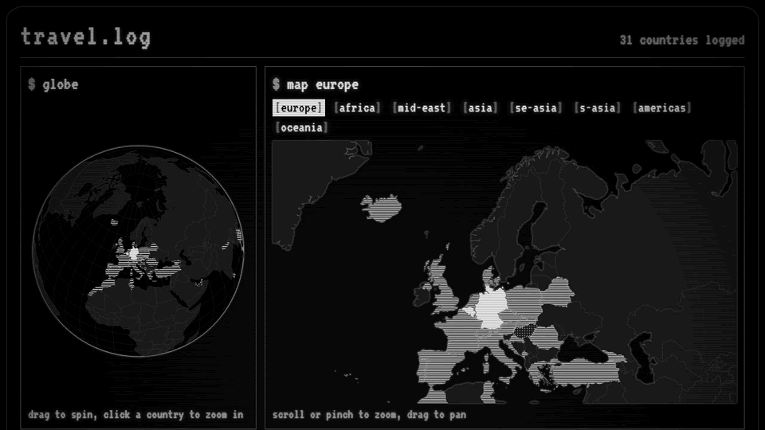
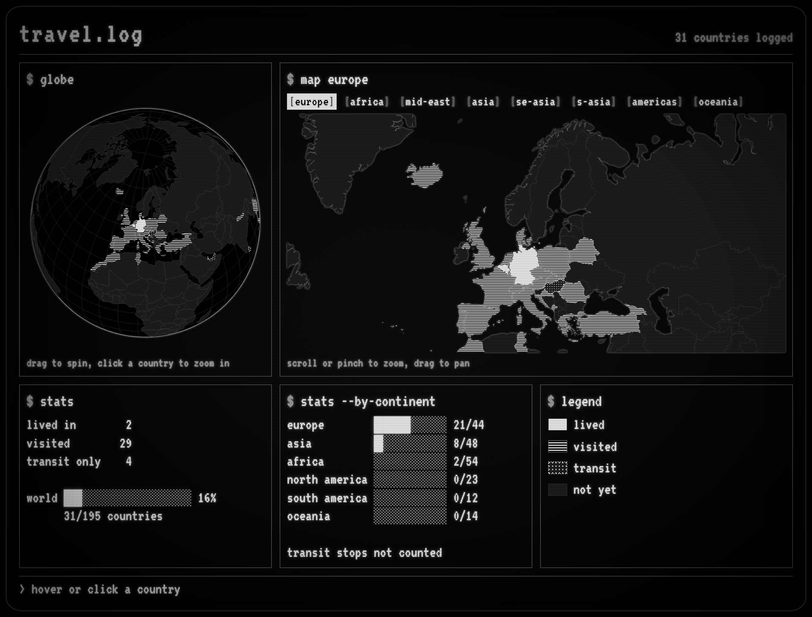
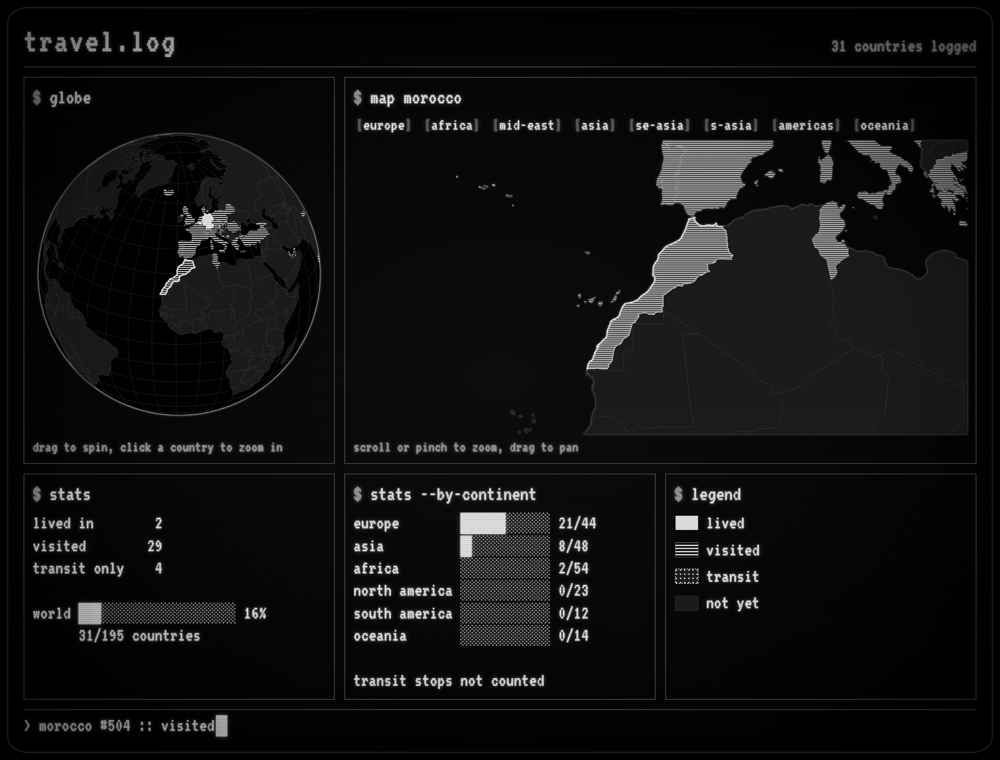
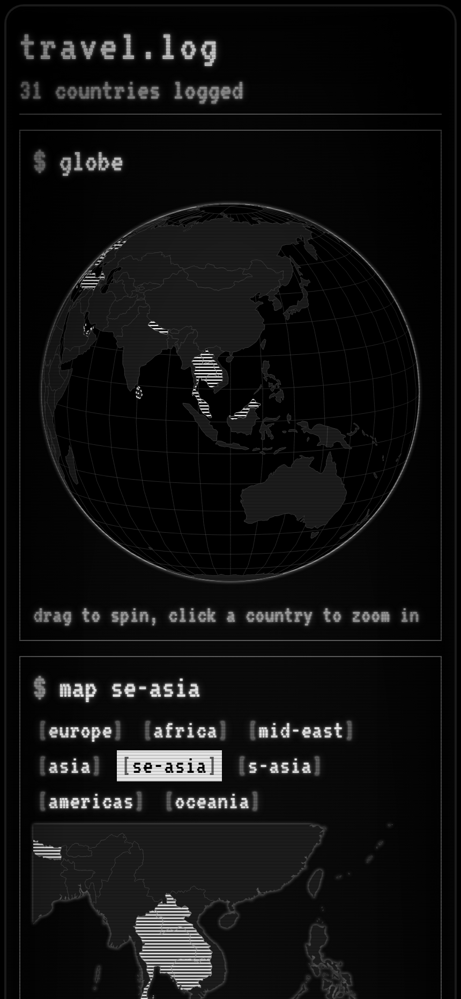

# travel.log

Static site showing where I've lived, visited and transited. No build step.

## Screenshots

The whole dashboard: a spinnable globe, a zoomable regional map and the stats,
all drawn from `countries.js`.

Click a country on either map and both views follow it, with the status line
reporting its id and status.

On a phone everything stacks into a single column.

## Run locally

The map data is loaded with `fetch`, which browsers block on `file://`, so serve the docs folder:

    cd docs && python -m http.server 8000

then open http://localhost:8000.

## Deploy

GitHub Pages: Settings > Pages > Deploy from a branch > main, /docs. Nothing to compile.

## Add a country

Edit `countries.js`. Hover a country on the site to see its id in the status line.

Overseas territories listed in `territories.js` (French Guiana, the Dutch Caribbean
islands, ...) count as countries of their own, so log them with their own id if you
have been there.

## Files

- `countries.js`: the travel log (the only file you normally edit)
- `territories.js`: overseas territories split off from their parent country, so
  colouring France does not colour French Guiana
- `app.js`: globe, regional map and stats
- `style.css`: CRT look
- `data/`: world-atlas country shapes (110m for the globe, 50m for the regional map)

Outside `docs/`, the `img/` folder holds the screenshots above and the looping
clip (960x540 gif, ~1 MB, no sound) that is small enough to post as is.
